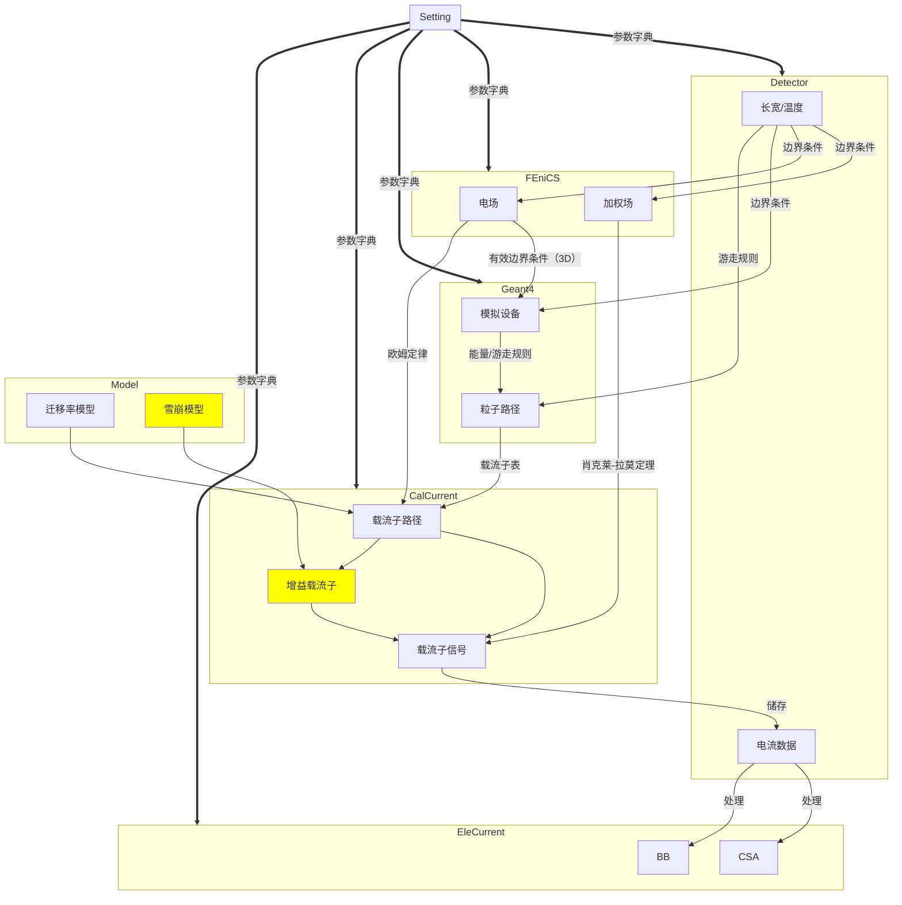

提出与解答问题请使用“代码”格式。

最后更新：2022/06/23

〇、程序运行顺序
python/run_batchjob.py[跑循环，变换参数调用gsignal.py]
{
	python/gsignal.py[主程序]
	*python/TCTtest.py[TCT主程序]*
	{
		raser/setting.py[设置参数]
		raser/geometry.py[设置探测器]
		raser/pyfenics.py[计算探测器内部电场]
		raser/g4particles.py[在Geant4中生成实验器材，并模拟粒子穿行路径]
		*raser/source.py[生成TCT激光源，模拟光束并产生光生载流子]*
		raser/calcurrent.py[计算载流子产生及漂移]
			raser/model.py[载流子漂移与增益的模型]
		raser/elecurrent.py[计算电路对产生信号的处理]
	}
	python/drawsave.py[储存gsignal.py产生的数据并画图]
}
python/add_noise_raser.py[给循环产生的数据增加噪声，并计算时间分辨]
python/time_scan.py[循环上程序并得到时间分辨与变化参数的关系]

一、RASER库
1、Setting类
对每个接下来的模块，提供一个参数字典，尽量让模块需要传入的参数都集中在这个字典里
目前各类参数出入关系大致如下：



2、Detector类
包括：
参数：长宽高、温度、电压、掺杂、构型
电极设置
电流储存

```
Fu,22/6/22,Q:为什么电流要储存在Detector类中？
Tan,22/6/23,A:可以换类或者新建一个类
```

3、FenicsCal类
包括：
函数空间：对pin是整个空间做缩放平铺，对3d是方形区域，到最远端电极柱外50um止。

```
Fu,22/6/22,Q:3d的设定导致MyDetectorConstruction类需要从本类获取参数，并设置了judge_fenics_range方法。考虑到外部区域未耗尽，可否避免？
Tan,22/6/23,A:这个应该还可以解决边界问题吧。
```

mesh网格：基于给定函数空间，分出有限元法需要的网格。3d需要额外挖掉电极柱。LGAD增益区过薄时会无法有效模拟，因为mesh网格甚至大于增益区厚度。

电场&加权场：在给定的
    空间、
	电荷密度（有效掺杂/0，用泊松型/拉普拉斯型方程标注）、
	边界条件（正极加偏压，负极置0/读出极置1，其余极置0；
		pin/lgad使用平板电极，3d使用柱状电极；
		pin/3d使用均匀掺杂，LGAD使用分段掺杂）
下利用FEniCS解出对应的场。存在若干方法将某点的场值以标量或列表的形式返回。

    Fu,22/6/22,Q:现有解电场程序默认器件已完全耗尽，若使用了未耗尽的电压值则会在体区内产生电压极值。如何处理？
    Fu,22/6/22,Q:目前想到的方案有：将极值前后的电势直接置为与邻接电极相同，并将导数不连续点视	同电极，或对电场进行预检查，发现有此类现象弹出warning
    Tan,22/6/23,A:可以了解一下TCAD是怎么解决的，看有没有类似的方法。

4、g4particle.py
Geant4允许用户扩展主程序中创建的类，在构造方法中传入参数，在Start方法中定义待记录数据，在End方法中收集这些数据。

	Fu,22/6/22,Q:SetUserAction方法有什么作用？应该传入什么？
	Tan,22/6/23,A:这是Geant4本身的框架，我理解传的是循环内的东西。

(1)MyDetectorConstruction类
包括Geant4软件中需要模拟的各种实验器材，包括：
实验箱（即'world'）
铝箔
探测器及其基底

	Fu,22/6/22,Q:3d探测器也拥有一个基底，而不是电极贯穿材料吗？
	Tan,22/6/23,A:3D探测器厚的话不需要基底，薄的话可以有基底
	
	Fu,22/6/22,Q:是否应该将其提取出来作为外在参数？属于实验数据的组成部分，且不一定持续使用
	Tan,22/6/23,A:可以
	
	Fu,22/6/22,Q:为什么铝和硅材料可以共用创建函数，而碳化硅的创建函数需要单独定义？
	Tan,22/6/23,A:SiC Geant4里面没有定义

LGAD对照探测器（参照设备）及其基底
	同上

pcb板（视为二氧化硅）

(2)MyActionInitialization类
依次定义并执行：
MyPrimaryGeneratorAction类确定粒子束的方向和能量

	Fu,22/6/22,Q:两个参数对应什么放射源的电子？是否是一个应该提取的参数？
	Tan,22/6/23,A:参数为粒子入射和出射位置
	
	Fu,22/6/22,Q:GeneratePrimaries有什么作用？
	Tan,22/6/23,A:Geant4框架内的东西，会自动执行。代码中的含义是每个事例运行两个电子。

MyRunAction类定义剂量单位

```
Fu,22/6/22,Q:有什么作用？
Tan,22/6/23,A:没啥用，例子里面有就照抄过来了。
```

MyEventAction类给定粒子起点和终点，计算粒子瞄准路径和实际射出路径所张角度

```
Fu,22/6/22,Q:RecordDevice有什么作用？这个方法真正被执行是在下一个类中，为什么要在这个类中定义？、
Tan,22/6/23,A:见下。
```

MySteppingAction类记录每个事例粒子每步的位置、能量损耗，并求和得到总能量损耗

```
Fu,22/6/22,Q:为什么以上数据的真正收集在这个类中，而不跟角度同时？
Tan,22/6/23,A:Geant4的MyEventAction和MySteppingAction在Geant4中循环执行的，很难一两句说清楚。想搞懂，看一下Geant4里面的例子，比较简单。
```

(3)Particles类
是g4particle.py的入口，启动Geant4运行管理器、生成种子、初始化、定义物理世界、定义并最终收集数据列表。额外有可视化选项。

```
Fu,22/6/22,Q:为什么数据列表要定义为global？与多线程有关吗？
Tan,22/6/23,A:跟Geant4本身的多次循环相关。
```

4'.TCTTracks类
根据高斯光束波长、焦点、腰宽和射入方向，以及材料吸收率等参数确认在材料各处生成的载流子量，然后直接插入5.(2)之后（使用CalCurrentLaser(CalCurrent)类实现）。

```
Fu,22/6/22,Q:TCT的高密度载流子还满足不互相影响、不互相复合、不偏离价带底&导带顶的条件吗？
```

5.CalCurrent类
定义了磁场与磁迁移率（暂时没有使用)

```
Fu,22/6/22,Q:磁迁移率有没有与普通迁移率类似的模型？
Tan,22/6/23,A:磁影响小，暂时不考虑。
```

(1)载流子列表生成
将g4particle.py中生成的粒子路径与能量损耗转化为当地对应数量的电子-空穴对集群。MIPs粒子以远快于载流子漂移的速度穿过空间电荷区，所以认为这些载流子同时在1ns生成。

```
Fu,22/6/22,Q:对单个事例模拟只选取了0号事例，对批量模拟也只选取了前batch个，需要改进？
Tan,22/6/23,A:单个事例有筛选条件，希望尽量找到粒子径迹较大的，比较明显。只取前batch个是跟批量运行有关，实际所有事例都被收集了。
```

(2)载流子漂移
不考虑载流子间相互作用，对载流子列表循环：
	对每个电子-空穴对集群，将其分为电荷集群和空穴集群，并视之为带有总量电荷的单个带电粒子
		后续会考虑热运动，所以将这些粒子的热运动一齐考虑存在一点小误差
	对每个集群，认为其运动遵循欧姆定律。粒子运动时，
		delta_p移动固定步长，方向由洛伦兹力确定
		drift_v由欧姆定律确定速度，v=\mu E,\mu为迁移率，E为起点和终点平均电场
			（此处调用电场及迁移率模型）

```
Fu,22/6/22,Q:有磁场时这样处理正确吗？
Tan,22/6/23,A:不考虑磁场
```

​		并由速度和路径求得时间
​		但下一步的起点不是这一步的终点，而是终点向外叠加一个高斯分布的位移(drift_s_step)
​			此时若粒子超出探测器边界，则将粒子位置设为边界处
​		charge_collection粒子位移一步产生信号q\Delta U_w.
​			（此处调用加权场）
​		save_inf_track记录五项信息，包括粒子位置（占三项）、时刻、信号大小
​		drift_end_condition检查粒子是否应该结束漂移，若是则结束循环
​	
(2)' 载流子增益及增益载流子漂移
对每步载流子漂移，额外增加一步：
根据平均电场，利用增益率模型计算载流子在某处产生的增益载流子数量。
为避免大量雪崩载流子的实际计算，将粒子每步漂移当做一次指数倍增过程。

```
Fu,22/6/22,Q:对于固定的漂移步长，这对吗？
Tan,22/6/23,A:不太清楚，不过感觉你这里的解释感觉不通畅。并没有解释如何避免大量雪崩载流子的实际计算。
```

然后将这些增益载流子送去漂移，起始时间为对应的增益发生时间


(3)电流存储
通过get_current将电流信息存储到MyDetector中。

迁移率模型与增益率模型均储存在model.py中。

6.Amplifier类
定义两种放大器：CSA和BB，并将整流后的电流信号调整成与示波器最小单位相一致（50ps），以数字形式存储。

二、python程序
1、gsignal.py
主程序。
对单次模拟，程序会按顺序创建Setting对象、Detector对象（对3D探测器可以添加自定义电极）、FEniCS对象、Particles对象、CalCurrent对象及EleCurrent对象，然后唤起drawsave.py保存产生的数据并绘图。
不论单次或批量模拟，Geant4都会产生多个入射粒子。
在批量运行模式下，主程序会针对每个入射粒子，生成对应的CalCurrent对象与EleCurrent对象，将电流信号存储为.csv文件。

2、run_batchjob.py
提交作业（至多20个）到计算节点进行批量运行。
作业为自动生成的.sh指令文件，每个作业执行一次以批量运行模式运行的主程序gsignal.py。
每个作业会被分配若干事例。
如：总事例数40000，每个作业被分配到2000个，1号作业对应Geant4的1号至2000号事例，2号作业对应2001号至4000号，以此类推。
另有扫描模式，此模式中不同作业执行的主程序，其配置会被改变（通过生成不同的.json文件改变）。如scan_voltage，会将总事例数分为十份，每份输入给-50V至-500V不同偏压的探测器。

3、add_noise_raser.py
由各组信号的上升时间分布得到时间分辨。
存在两种方法：
	一是对每组理想信号，我们往上加一个高斯噪声得到实际信号，
	然后从带噪声的信号里得到一个50%信号的CFD时刻；
	二是对每组理想信号，我们根据附近的信号上升速度给这个时刻加一个jitter项，得到50%信号的CFD时刻。
将所有的CFD时刻放在一起去拟合高斯分布，得到时间分辨（高斯分布的sigma参数）和不确定度。
目前程序中采用后者。

4、time_scan.py
可以分成两部分：
第一部分time_scan提交作业到（至多20个）到计算节点进行批量运行。
作业为自动生成的.sh指令文件，对若干变量进行扫描，分别运行add_noise_raser.py，得到时间分辨与变量的变化关系。
第二部分draw_scan将上述变化关系做成图像。

5、drawsave.py
画图与保存程序。接收gsignal.py产生的各对象。
draw_ele_field、draw_ele_field_scan：电场分布
draw_drift_path：载流子漂移路径
draw_plot：信号与电子学处理
energy_deposition：粒子能量损耗分布
draw_scat_angle：粒子角分布

三、setting.json配置文件
由json文件的字典列表组成，列表里的每个字典对应一个探测器的一组参数，可以同时储存多个构型不一致的探测器。未来预计可以修改成能存储同类、不同名称的探测器。

```
Fu,22/6/22,Q:每个探测器内的参数分段完全凭人工，感觉有优化点
```

TCT的参数配置也一并放在配置文件中。

四、shell脚本run
运行主程序及传入参数配置的脚本。
对单个事例，需要先唤起singularity镜像再运行。
对批量作业，程序中自带镜像配置。

批量作业通过下面的路径提交，可以使用指令 hep_q -u username 查看作业运行情况，但需先添加环境变量，即执行如下指令：
export PATH=$PATH:/afs/.ihep.ac.cn/soft/common/sysgroup/hepjob-4.0-dev/bin/