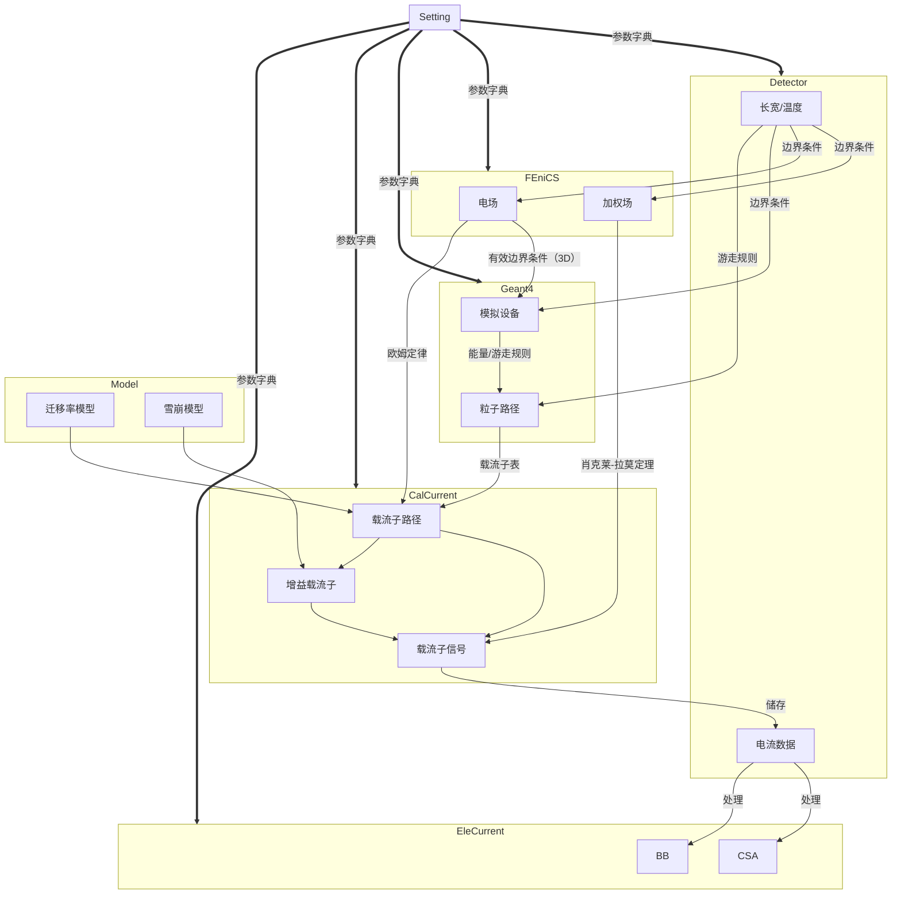

## RASER 简介

[[石航瑞]]

2023-05-17
12:30 ~ 13:00 

---
##  报告提纲

- 使用模拟的原因
- RASER模拟基本原理
- RASER基本结构和程序基础
- 目前RASER可以实现的功能

---
## 使用RASER模拟的原因
---
1. 通过模拟对实验中器件性能做出合理的估计
2. 指导探测器设计工作
3. 利用已知器件参数，通过模拟补全设计参数
>理论来自实践，理论指导实践

---
## RASER模拟的基本原理
- 基于真实的物理模型进行一定的简化
- 把握物理过程的核心和结果
---
### 模拟过程及方法（以碳化硅TCT模拟为例）
- 模拟的物理过程包括：
	- 激光入射，激发载流子
	- 载流子在电场作用下漂移
	- 漂移载流子在极板上产生感应电流
	- 感应电流经由电子学处理，通过示波器读出
---
- 实验装置图

---
#### 1. 激光入射激发载流子
- 将激光看作MIP粒子（最小电离粒子），半导体对于激光的吸收是一个复杂的过程，但在模拟中我们可以进行一定的简化，即：
$$I=I_0\cdot exp(-\alpha x)$$ 
- 对于每一份吸收能量等于禁带宽度的光子便认为产生一对电子-空穴对。 

---
#### 2. 载流子在电场作用下漂移
- 计算电场时主要方程：$$\nabla ^2 U(x) = -eN_{eff}(x)/\varepsilon$$
- 采用的求解器为FEniCS（将在接下来替换为DEVSIM）
	- 变分和有限元求解器
- 同样采用一定的简化，在全耗尽的情况下忽略自由载流子，简化计算

---
#### 3. 载流子漂移产生感应电流
- 载流子漂移采用迁移率模型：$$v_{p,n} = \mu_{p,n}(T,N_{eff},E) E$$
- 加上载流子随机热运动：$$Dx\sim N(0,(D dt)^2), D = \mu k_B T / q$$
- 计算感应电流中主要方程为肖克莱-拉莫斯定理：$$I_q(t)=q\vec{v_q}(t)\cdot \nabla U_\omega(\vec{x_q}(t))$$
---
#### 4. 电子学处理
- 通过ngspice处理，根据实验中采用的T1板处理模拟的电流信号并输出。
---
### RASER基本结构和程序基础
1. 采用模块化，有一定公用部分，也有各模块独立部分
2. 使用python语言编写，使用git进行管理
---
#### 程序架构

---
### 目前RASER程序可以实现的功能
- 对不同的器件
	- [Si](#HPK-Si-LGAD) & [SiC](#SiC-LGAD) LGAD
	- [Si](#HPK-Si-PIN) & [SiC ](#NJU-PIN) PIN
	- [Si Strip](#Si_Strip)
	- [3D-SiC](#plugin3D)
---
- 对不同的方法
	- TCT
		- edge
		- top
	- 不同粒子入射
		- $\alpha , \beta$
	- 时间分辨
---
## 附录
### 模拟器件参数

NJU-PIN
<h2 name="NJU-PIN"></h2> 

---

- SiC-LGAD  

---

- plugin3D  

---

- HPK-Si-PIN  

---

- HPK-Si-LGAD  

---

- Si_Strip  

### 程序结构
